# RSVP Management System 💌

Project ini adalah sebuah aplikasi berbasis Django untuk mengelola sistem RSVP / Wedding Invitation. Aplikasi ini menyediakan fitur untuk mengelola undangan, konfirmasi kehadiran, tracking pengunjung, dan manajemen tamu. Selain itu, aplikasi ini juga mendukung role management untuk membedakan hak akses pengguna (admin dan user biasa). Aplikasi ini juga dilengkapi dengan interface admin yang user-friendly untuk mengelola seluruh data. 🎉

## Fitur ✨

- **User Management**: Login, logout, dan manajemen pengguna admin. 👤
- **Person Management**: Mengelola data tamu dengan kode unik untuk setiap undangan. 👥
- **RSVP Management**: Create, Read, Update, Delete konfirmasi kehadiran tamu. 💌
- **Comment System**: Sistem komentar untuk setiap RSVP. 💬
- **Tracking System**: Melacak IP address dan browser info pengunjung website. 📊
- **Export Data**: Download data dalam format CSV dengan filter pencarian. 📋
- **Responsive UI**: Interface yang responsif menggunakan TailwindCSS. 📱
- **Pagination**: Menampilkan data dengan dukungan paginasi. 📄
- **Search & Filter**: Pencarian dan filter data berdasarkan nama, kode, atau kriteria lainnya. 🔍
- **Invitation Page Management**: Kelola halaman undangan dengan mudah menggunakan tombol toggle. 📨✨

## Struktur Project 🗂️

```bash
project/
├── app/
│   ├── forms/         # Django forms untuk input validation
│   ├── models.py      # Database models (User, Person, RSVP, Comment, Tracking)
│   ├── views/         # View logic untuk setiap modul
│   ├── urls.py        # URL routing
│   └── utils.py       # Utility functions (pagination, CSV export)
├── templates/         # HTML templates
│   ├── partials/      # Reusable template components
│   ├── registration/  # Django registation template components
│   ├── _base.html     # Base template
│   ├── trackings.html # Tracking management page
│   ├── konfigs.html   # Invitation page configuration
│   ├── persons.html   # Person or tamu management page
│   ├── rsvps.html     # RSVP management page
│   ├── users.html     # User management page
│   └── wedding.html   # Wedding Invitation page
├── static/            # Static files (CSS, JS, Images)
├── data/              # Sample data files (JSON fixtures)
└── Dockerfile         # Dockerfile for the app
├── manage.py          # Django management script
├── requirements.txt   # Python dependencies
└── .env               # Environment variables
```

## Model Database 🗄️

_NOTE: untuk memudahkan, saat ini database di set menggunakan sqlite. untuk mengubah ke database PostgreSQL, MySQL bisa diubah di file `rsvp/settings.py`._

### User Model

- Extends Django's AbstractUser
- Mengelola autentikasi admin

### Person Model

- `code`: Kode unik untuk undangan (max 50 chars)
- `name`: Nama tamu (max 255 chars)
- `created_at`, `updated_at`: Timestamp

### RSVP Model

- `code`: Kode undangan (opsional, max 50 chars)
- `name`: Nama tamu (max 255 chars)
- `message`: Pesan dari tamu (TEXT, nullable)
- `attendance`: Status kehadiran (YES, NO, MAYBE YES, MAYBE NO)
- `is_active`: Status aktif (Boolean, default True)
- `created_at`, `updated_at`: Timestamp

### Comment Model

- `rsvp_id`: Foreign key ke RSVP
- `name`: Nama komentator (max 255 chars)
- `comment`: Isi komentar (TEXT, required)

### Tracking Model

- `code`: Kode tamu (opsional)
- `ip`: IP address pengunjung
- `browser_info`: Informasi browser
- `is_active`: Status aktif
- `created_at`, `updated_at`: Timestamp

## Instalasi 🛠️

1. Clone Repository: 📂

   ```bash
   git clone https://github.com/repodevs/rsvp.git
   cd rsvp
   ```
2. Buat Virtual Environment: 🐍

   ```bash
   python -m venv venv
   source venv/bin/activate  # Linux/Mac
   # atau
   venv\Scripts\activate     # Windows
   ```
3. Install Dependencies: 📦

   ```bash
   pip install -r requirements.txt
   ```
4. Buat `.env` file: 📝

   ```bash
   cp env.example .env
   ```

   Update isi dari .env sesuai kebutuhan:

   ```
   DEBUG=True
   ```
5. Setup Database and Static Files: 🗄️

   ```bash
   python manage.py makemigrations
   python manage.py migrate
   python manage.py collectstatic --noinput
   ```
6. Load Sample Data (Opsional): 📊

   ```bash
   python manage.py loaddata data/*.json
   ```
7. Create Superuser: 👑

   ```bash
   python manage.py createsuperuser
   ```
8. Run Development Server: 🚀

   ```bash
   python manage.py runserver
   ```
9. Akses Aplikasi: 🌐

   - Website: [http://localhost:8000/](http://localhost:8000/)
   - Dashboard: [http://localhost:8000/app/](http://localhost:8000/app/)
   - Django Admin Panel: [http://localhost:8000/admin/](http://localhost:8000/admin/)

## Endpoints 🚪

### Dashboard Endpoints

- `/app/`: Dashboard untuk semua fitur. 📋

### API Endpoints

- GET `/api/configs/`: API for Invitation Page configuration. ⚙️

## Fitur Export CSV 📊

Aplikasi mendukung export data ke format CSV dengan fitur:

- Export semua data atau hasil pencarian
- Filename otomatis dengan timestamp
- Header kolom yang user-friendly
- Handling untuk berbagai tipe data (datetime, boolean, null values)

## UI Components 🎨

- **Responsive Design**: Menggunakan TailwindCSS untuk tampilan yang responsive
- **Modal System**: Modal untuk view, edit, dan delete data
- **Search & Filter**: Real-time search dengan parameter query
- **Status Indicators**: Visual indicator untuk status kehadiran dan aktivitas
- **Action Buttons**: Tombol aksi yang intuitif untuk setiap operasi

## Development Note 🛠️

### Menambah Data Sample:

```bash
# Generate data sample baru
python manage.py loaddata data/*.json
```

### Generate TailwindCSS

```bash
npx @tailwindcss/cli -i ./static/src/input.css -o ./static/src/output.css --watch
```

## Screenshots 📸

## Login and Registration

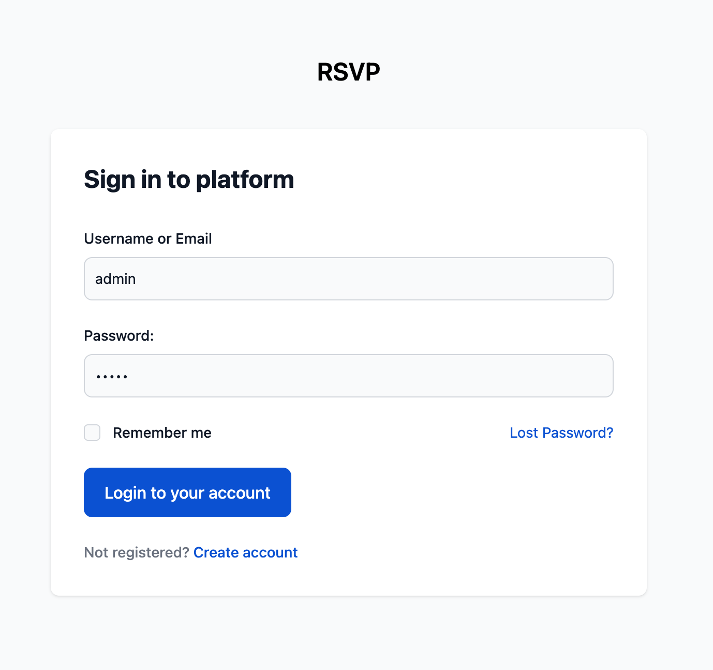

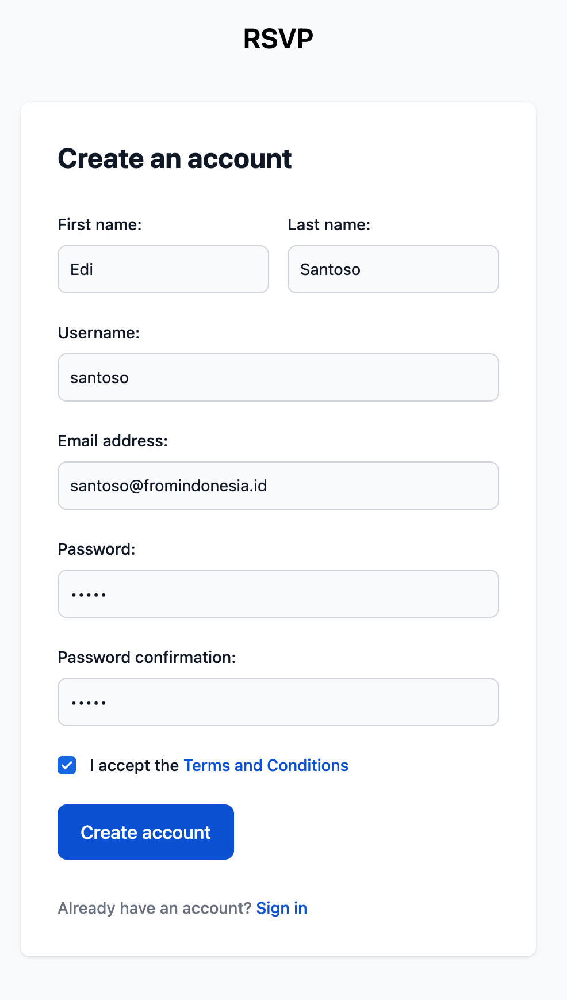

### Dashboard

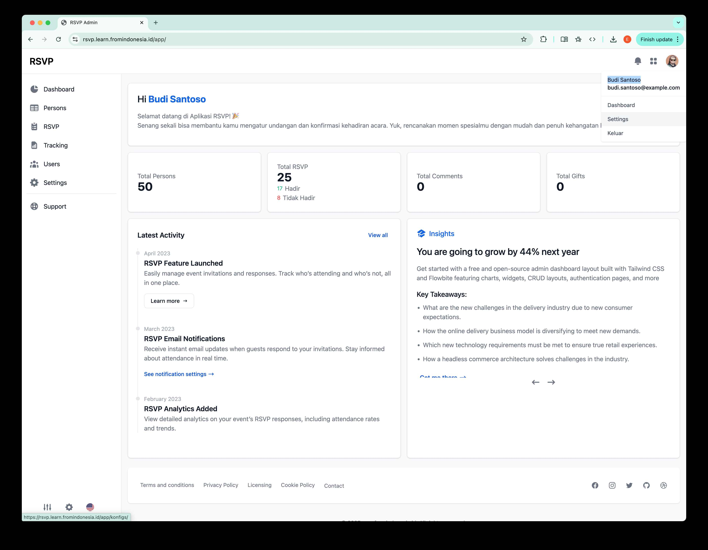

### Person Management

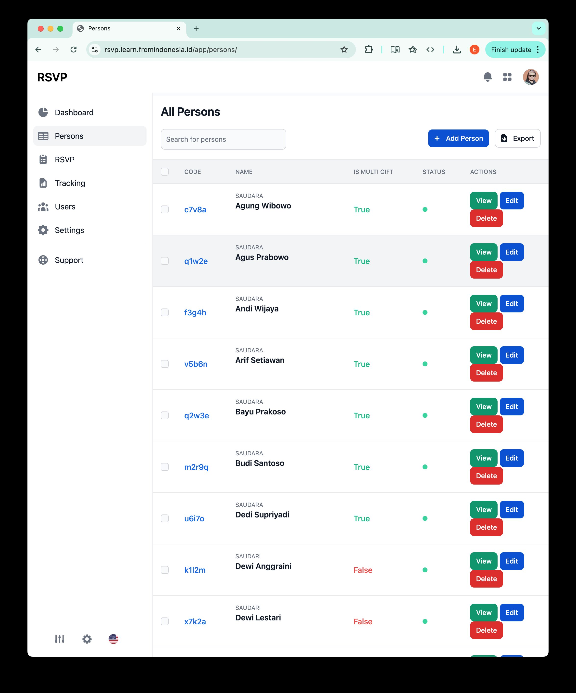

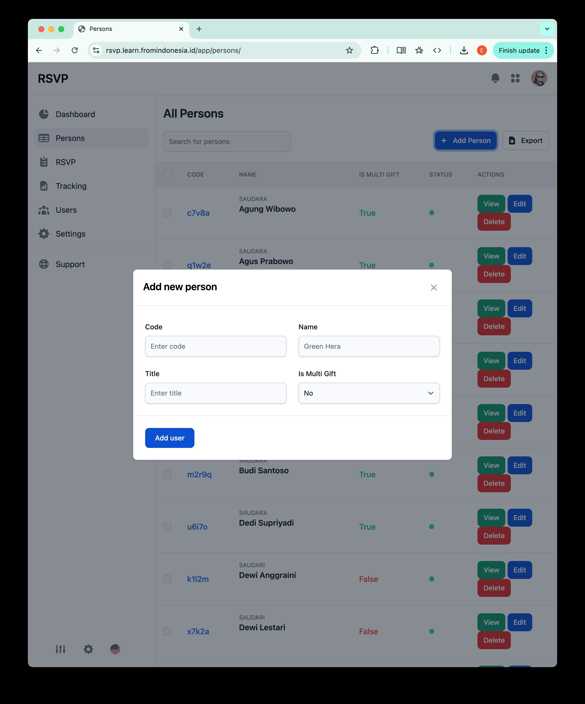

### RSVP Management

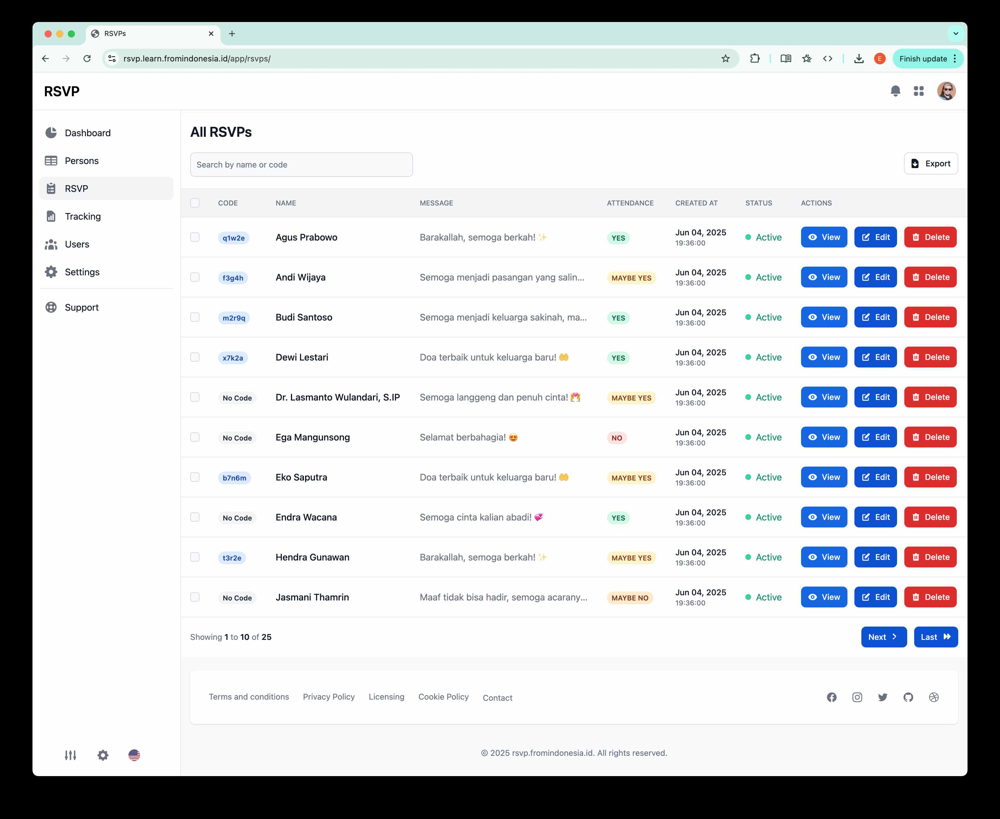

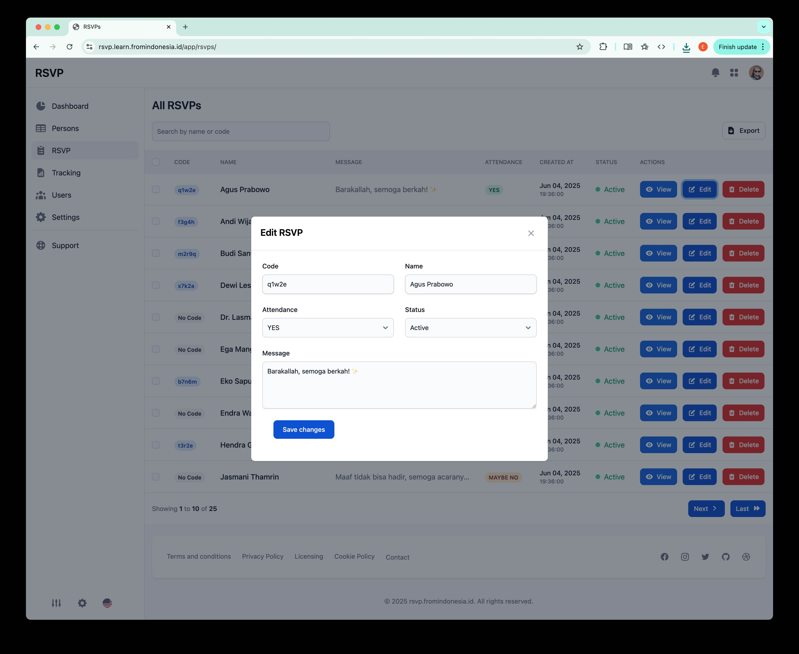

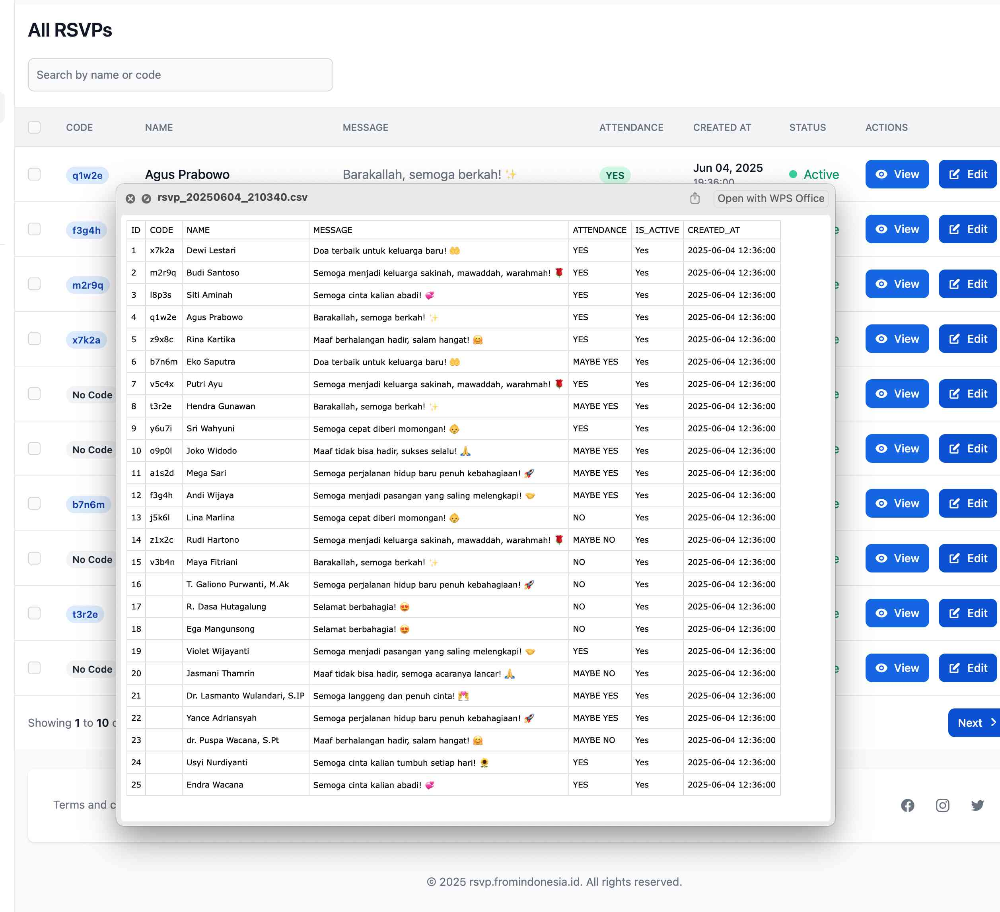

### Tracking

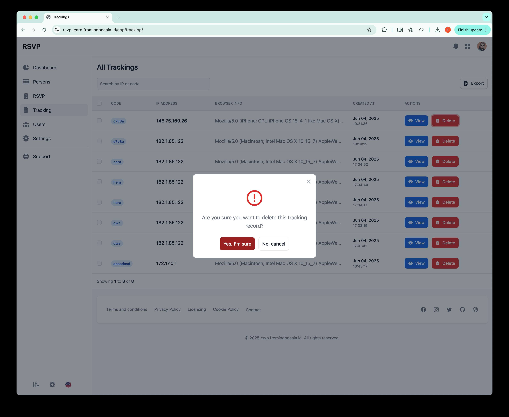

### User Management

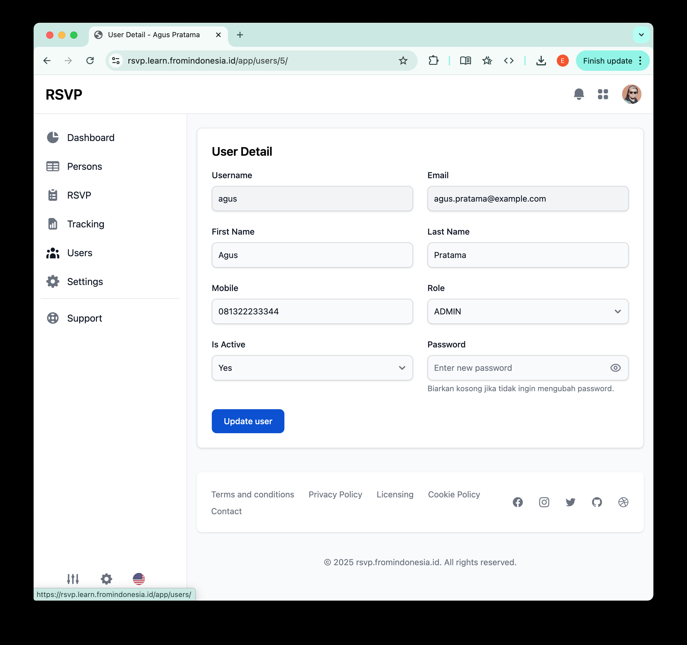

### Invitation Page Configuration

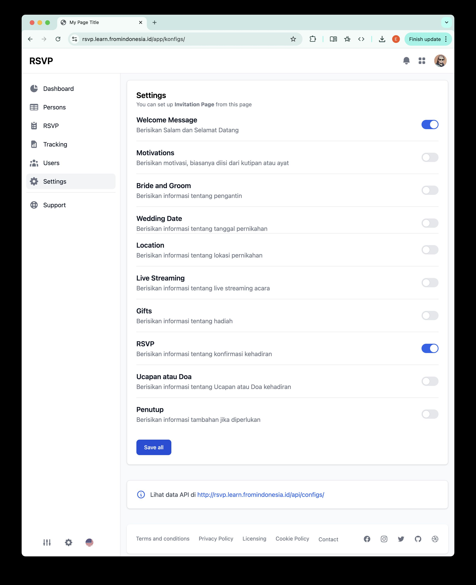

## Invitation Page Result

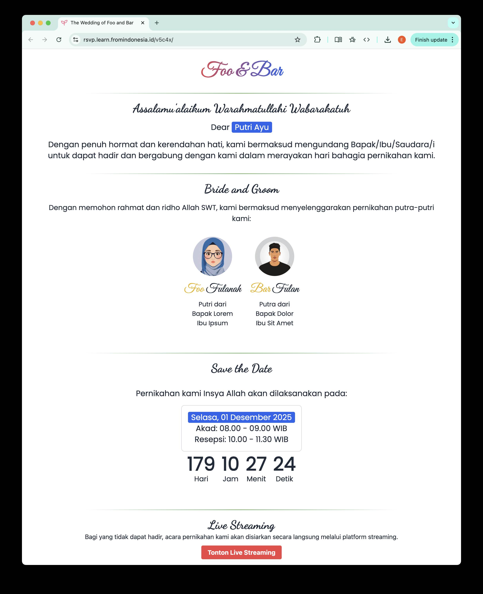

## License 📜

This project is licensed under the MIT License. 🏛️

## Contributing 🤝

Contributions are welcome! Please fork the repository and submit a pull request. 🚀

## Contact 📧

For questions or support, please contact [edi20240200005@sibermu.ac.id](mailto:edi20240200005@sibermu.ac.id "send email to author"). 💌
